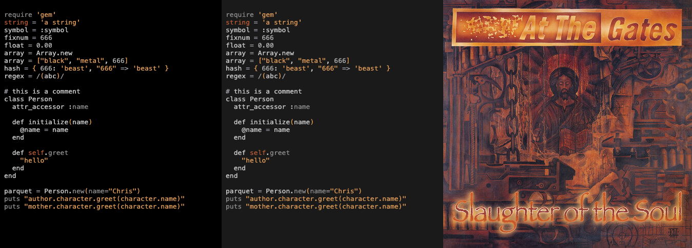
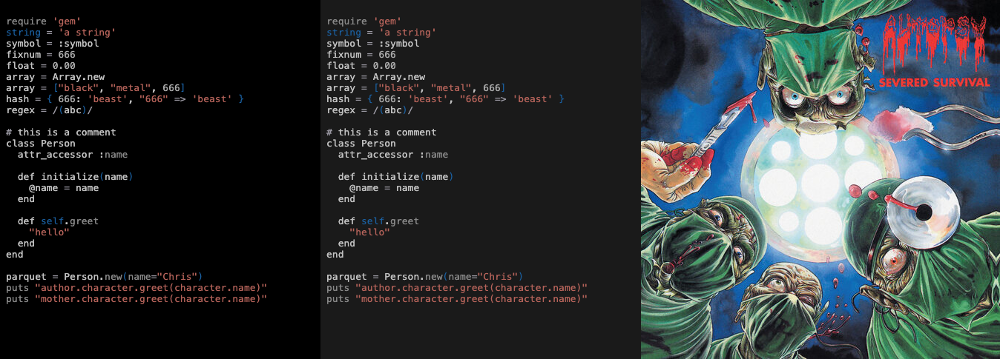
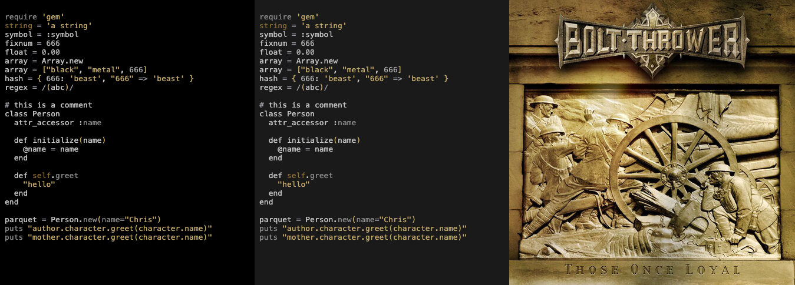
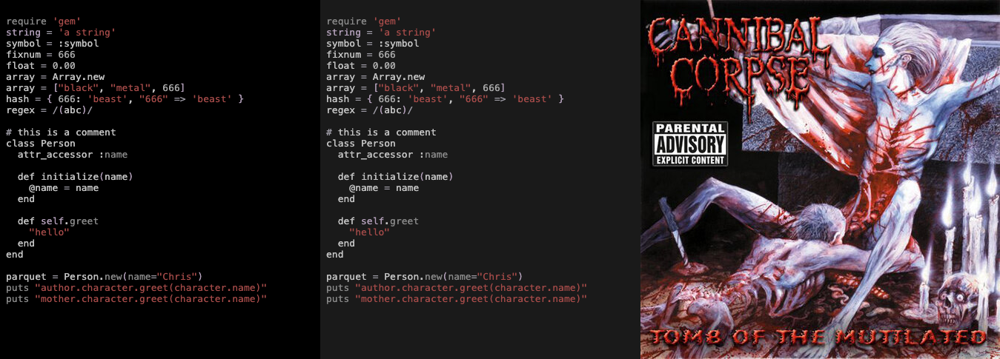
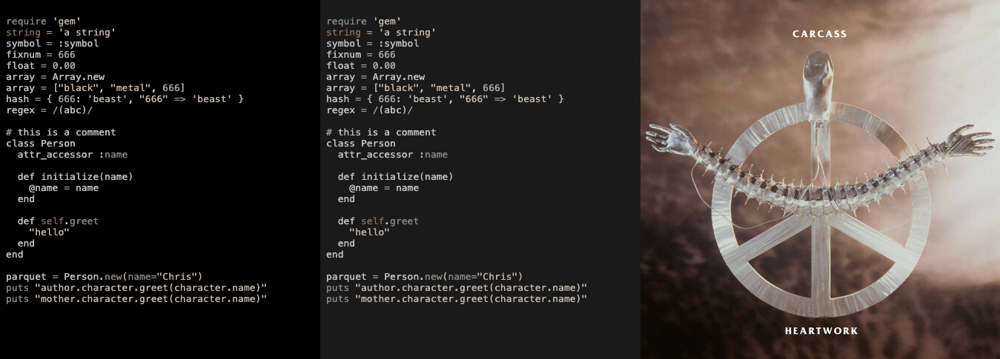
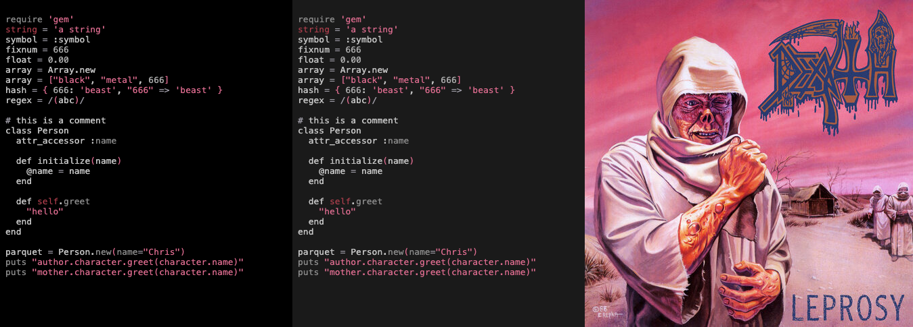
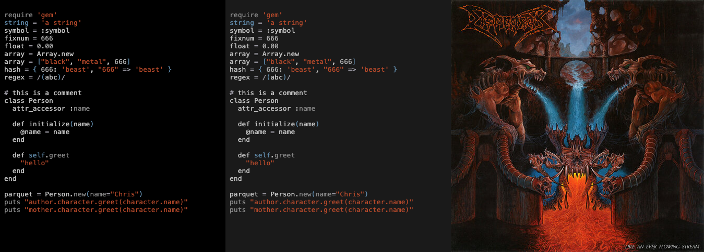
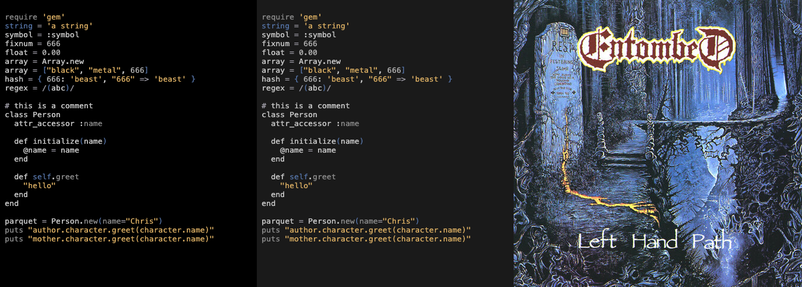
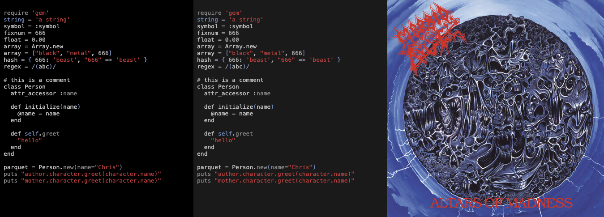

# Death Metal Sublime Text

A collection of death metal-inspired Sublime Text color schemes!

**Neovim users:** Check out [death-metal-theme-neovim](https://github.com/stereoabuse/death-metal-theme-neovim) instead.

This theme collection is based on the excellent work done by [@cdmill](https://github.com/casedami) on [neomodern.nvim](https://github.com/cdmill/neomodern.nvim) and [@metalelf0](https://github.com/metalelf0) on [black-metal-theme-neovim](https://github.com/metalelf0/black-metal-theme-neovim). 🤘

## Included Themes

9 canonical death metal albums, each with colors extracted from the original album covers.

### At the Gates - Slaughter of the Soul (1995)



### Autopsy - Severed Survival (1989)



### Bolt Thrower - Those Once Loyal (2005)



### Cannibal Corpse - Tomb of the Mutilated (1992)



### Carcass - Heartwork (1993)



### Death - Leprosy (1988)



### Dismember - Like an Ever Flowing Stream (1991)



### Entombed - Left Hand Path (1990)



### Morbid Angel - Altars of Madness (1989)



## Rationale

Each theme palette is extracted directly from the album artwork using color analysis. Colors are chosen to represent the album's visual aesthetic while remaining readable for code.

## Installation

### Package Control

1. Open Command Palette (`Cmd+Shift+P` on Mac, `Ctrl+Shift+P` on Windows/Linux)
2. Type "Package Control: Install Package"
3. Search for "Death Metal"
4. Install the package

### Manual Installation

1. Download the repository or clone it:
   ```bash
   git clone https://github.com/stereoabuse/death-metal-theme-sublime.git
   ```

2. Copy the `.sublime-color-scheme` files from the `themes/` directory to your Sublime Text Packages folder:

   - **macOS**: `~/Library/Application Support/Sublime Text/Packages/User/`
   - **Windows**: `%APPDATA%\Sublime Text\Packages\User\`
   - **Linux**: `~/.config/sublime-text/Packages/User/`

3. Open Sublime Text
4. Go to Preferences → Color Scheme
5. Select your theme from the list (e.g., "Death Metal - Death (Leprosy)")

## Available Themes

- Death Metal - At the Gates
- Death Metal - Autopsy
- Death Metal - Bolt Thrower
- Death Metal - Cannibal Corpse
- Death Metal - Carcass
- Death Metal - Death (Leprosy)
- Death Metal - Dismember
- Death Metal - Entombed
- Death Metal - Morbid Angel


## Album References

- At the Gates: Slaughter of the Soul, 1995
- Autopsy: Severed Survival, 1989
- Bolt Thrower: Those Once Loyal, 2005
- Cannibal Corpse: Tomb of the Mutilated, 1992
- Carcass: Heartwork, 1993
- Death: Leprosy, 1988
- Dismember: Like an Ever Flowing Stream, 1991
- Entombed: Left Hand Path, 1990
- Morbid Angel: Altars of Madness, 1989

## Credits

- Original architecture: [@cdmill](https://github.com/cdmill) - [neomodern.nvim](https://github.com/cdmill/neomodern.nvim)
- Black metal themes inspiration: [@metalelf0](https://github.com/metalelf0) - [black-metal-theme-neovim](https://github.com/metalelf0/black-metal-theme-neovim)
- Death metal themes and color extraction: This repository

## Related Projects

- [Death Metal Neovim](https://github.com/stereoabuse/death-metal-theme-neovim) - The same themes for Neovim

## License

Apache 2.0 - See LICENSE file
